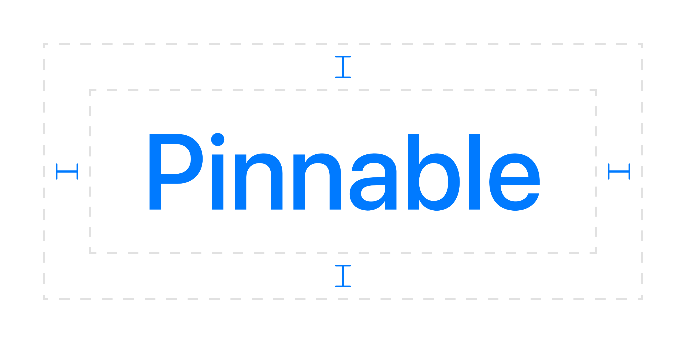

# Pinnable

Convenient Auto Layout

### Introduction

Pinnable provides convenient methods for creating `NSLayoutConstraint`s - the foundation of working with Auto Layout. However, the standard UIKit APIs don't offer enough defaults, and can also lead to frustrating results, for example, when you forget to set `translatesAutoresizingMaskIntoConstraints` (I typed that without looking it up by the way).

Pinnable introduces a "single" method - `pin` - that offers sane defaults, disables `translatesAutoresizingMaskIntoConstraints` when needed, and automatically activates constraints that are created.

This is not a DSL, there is no "magic," and it doesn't have fancy operator overloading. Because I don't really like those things :) It's just a _little_ more convenient than the built-in APIs.

### Getting Started

After you've imported Pinnable, you'll find new `pin` methods available on `UIView`, `UILayoutGuide`, `NSLayoutAnchor`, and `NSLayoutDimension`. Most of them are fairly self descriptive. For example, to constrain a view's leading anchor to another view's leading anchor, simply `pin` them together:

```swift
firstView.leadingAnchor.pin(to: secondView.leadingAnchor)

// With a constant
firstView.leadingAnchor.pin(to: secondView.leadingAnchor, constant: 20)

// ...and a priority
firstView.leadingAnchor.pin(to: secondView.leadingAnchor, constant: 20, priority: .defaultLow)
```

Or perhaps you'd like to pin all of the edges of the first view to second view:

```swift
firstView.pinEdges(to: secondView)

// With insets
firstView.pinEdges(to: secondView, insets: .init(top: 10, left: 20, bottom: 30, right: 20))

// ...or excluding the bottom edge
firstView.pinEdges([.top, .left, .right], to: secondView)
```

The methods available on `UIView` (and `UILayoutGuide`) are meant for creating constraints for multiple anchors (e.g., `pinEdges` can pin multiple edges, `pinSize` constrains both the width and height dimensions).

All of the `pin` methods return the constraints that were created, so you can reference them and mutate them however you'd like. Or feel free to ignore them. They don't mind.

### Tests??

Yeah, I should add them. I might someday. But I use this code in all my side projects and it hasn't broken anything yet ¯\\\_(ツ)_/¯
